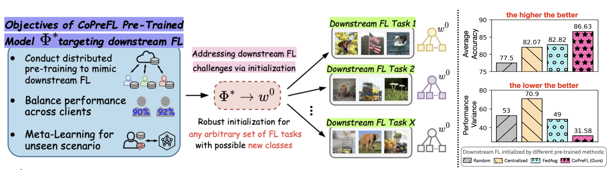

# Collaborative-Pre-training-for-Federated-Learning (CoPreFL)
The repository for our work on collaborative pre-training for Federated Learning, published in AAAI 2025.

- **Title:** Rethinking the Starting Point: Collaborative Pre-Training for Federated Downstream Tasks
- **Full paper link:** https://arxiv.org/pdf/2402.02225
- **Appendix of the paper:**

  
## Quick summary
### Findings
We found that initializing federated learning (FL) with different methods (i.e., random weights or centralized pre-training) results in limited performance, as these methods fail to capture the heterogeneous characteristics of unforeseen FL settings. This leads to either lower average accuracy or higher performance variance across clients (shown in the below right figure).

### Motivations
Given these findings and challenges, our goal is to design a pre-trained model that serves as a robust initialization for any unforeseen FL tasks (as shown in the figure below on the left). This pre-trained model should inherently provide downstream FL tasks with improved average accuracy and reduced variance across participants through initialization.

